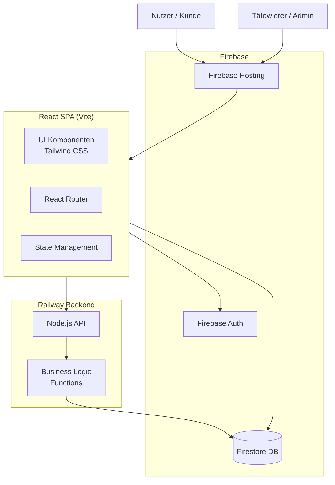

# Komponentendiagramm — TattooTime App1

```mermaid
graph TB
    subgraph Frontend ["React SPA (Vite)"]
        UI[UI Komponenten\nTailwind CSS]
        Router[React Router]
        State[State Management]
    end

    subgraph FirebaseBackend ["Firebase"]
        Auth[Firebase Auth]
        Firestore[(Firestore DB)]
        FBHosting[Firebase Hosting]
    end

    subgraph RailwayBackend ["Railway Backend"]
        NodeAPI[Node.js API]
        Functions[Business Logic\nFunctions]
    end

    User[Nutzer / Kunde]
    Artist[Tätowierer / Admin]

    User --> FBHosting
    Artist --> FBHosting
    FBHosting --> Frontend
    Frontend --> Auth
    Frontend --> Firestore
    Frontend --> NodeAPI
    NodeAPI --> Functions
    Functions --> Firestore
```
